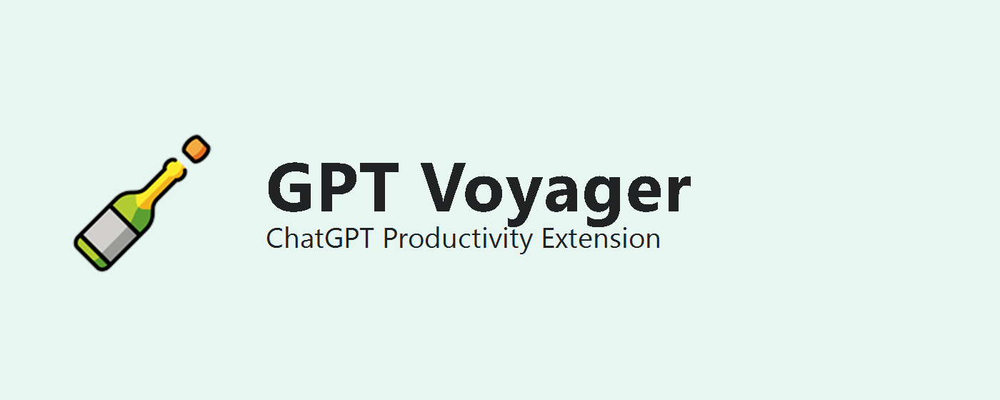

# GPT Voyager（ChatGPT 网页扩展）

<p align="center">
  
</p>

<p align="center">
  
</p>

<p align="center">
  <a href="https://github.com/Duang777/GPT/releases/latest">⬇ 下载最新 ZIP（Release）</a>
  ·
  <a href="https://github.com/Duang777/GPT">GitHub 仓库</a>
  ·
  <a href="https://duang777.github.io/GPT/privacy.html">隐私政策</a>
</p>

---

GPT Voyager 是一个面向 ChatGPT 网页端的效率扩展，目标是让你在一个侧边栏里完成会话管理、提示词复用、技术内容导出与本地备份。

## 快速开始（给使用者）
1. 打开 [Releases](https://github.com/Duang777/GPT/releases/latest) 下载最新 `zip`。
2. 解压后得到扩展文件夹（包含 `manifest.json`）。
3. Chrome/Edge 打开 `chrome://extensions/`。
4. 开启“开发者模式”。
5. 点击“加载已解压的扩展程序”，选择解压后的文件夹。
6. 打开 `https://chatgpt.com/`，右侧即可看到 GPT Voyager 面板。

## 核心功能
- 会话索引：自动采集可见会话，支持标题/ID/备注检索。
- 分类管理：文件夹、标签、星标、备注，支持快速筛选。
- 批量处理：多选会话批量加标签/设文件夹，并支持撤销。
- 提示词库：模板管理、变量填充、预设保存、批量导出。
- 导出能力：会话导出 Markdown/HTML，时间线节点导出。
- 公式工作台：提取公式，复制 LaTeX / Word 可粘贴 MathML。
- 图表工作台：识别 Mermaid，支持预览、收藏、导出源码/SVG/HTML。
- 本地备份：JSON 导出/导入（会话、分类、提示词、收藏、设置）。
- 体验优化：会话列表虚拟滚动、排序、卡片密度切换、宽度调节。

## 维护者发版（GitHub Release ZIP）
你现在的分发路径建议优先走 GitHub Release（不上商店也能给别人下载）：

1. 生成最新构建与 zip：
```powershell
npm run typecheck
npm run build
npm run package:zip
```

2. 在 `release/` 目录拿到 zip（示例）：
`gpt-voyager-extension-20260304-192210.zip`

3. 新建 GitHub Release，上传 zip 作为附件。
4. 用户从 `Releases/latest` 直接下载 zip 并安装。

详细步骤见：
- `docs/store/GITHUB_RELEASE_ZIP_GUIDE_ZH-CN.md`

## 本地开发

### 环境要求
- Node.js 20+
- Chrome/Edge（Manifest V3）

### 安装依赖
```powershell
npm install
```

如果网络较慢（中国大陆）：
```powershell
npm install --registry=https://registry.npmmirror.com
```

### 开发构建
```powershell
npm run dev
```

### 生产构建
```powershell
npm run build
```

### 打包 ZIP
```powershell
npm run package:zip
```

### 图标与商店素材（可选）
```powershell
npm run icons:prepare
npm run webstore:assets
```

## 项目结构
```text
src/
  manifest.json
  icons/*.png
  background/index.ts
  content/*
scripts/
  build.mjs
  package-release.ps1
  prepare-icons.ps1
  generate-webstore-assets.ps1
assets/
  webstore/*
docs/
  FEATURE_LOG.md
  features/*.md
  store/*.md
site/
  index.html
  privacy.html
```

## 文档索引
- 功能日志：`docs/FEATURE_LOG.md`
- 需求文档：`PRD.md`
- 上架资料：`docs/store/README.md`

## 图标来源说明
本项目图标使用 OpenMoji 的瓶子素材生成，详见：
- `docs/store/ICON_ATTRIBUTION.md`
